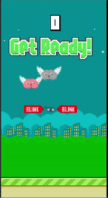

# FlappyBrain
## Requirement
1. [MindWave Mobile](https://store.neurosky.com/pages/mindwave): The Brainwave Sensing Headset by NeuroSky (notice that we are using version 1).
2. [ThinkGear Connector](http://developer.neurosky.com/docs/doku.php?id=thinkgear_connector_tgc): The ThinkGear Connector (TGC) runs as a background process on your computer and is responsible for directing headset data from the serial port to an open network socket.
3. [Unity](https://unity.com/)

## Setting up
1. Download our [project code](https://github.com/jayhung97724/Flappy-Brain/tree/TGC-Controller), and open it with Unity! (as there seems to be some problem with the master branch, be sure to switch to ***TGC-Controller*** branch).
2. Open `Unity/FlappyBirdStyleGame` in Unity Editor Mode.
3. We currently encountered an [issue](http://developer.neurosky.com/docs/doku.php?id=using_thinkgear_with_unity#introduction) building the application (we don't have Unity Pro).

## Pairing the Headband
1. Slide the switch on, pair it with the computer. Refer to the [User Guide](http://download.neurosky.com/support_page_files/MindWaveMobile/docs/mindwave_mobile_user_guide.pdf) for trouble shooting.

## Gaming
1. Play the game in Editor mode, remember to open the Game window of Unity and the bluetooth.
2. After the brain is flapping up and down (during which the app is connecting to TGC-Connector), you can blink to start the game.

    
3. If you die, blink again to restart the game.

## Documents 
1. [Project proposal](./Documents/IoT-porject.pdf)
2. [Progress report 1](./Documents/IOT_team1_190523.pptx)
3. [Progress report 2](./Documents/IOT_team1_190606.pptx) [Test Video](./Screenshot/[20190606]Flappy_Brain_Test_Video.mp4)
4. [.stl file of the case](./Documents/case.stl)
